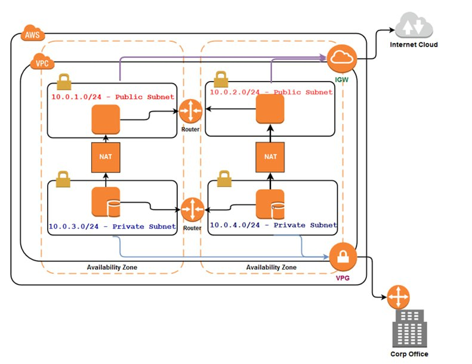
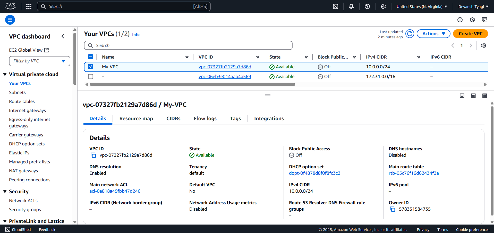
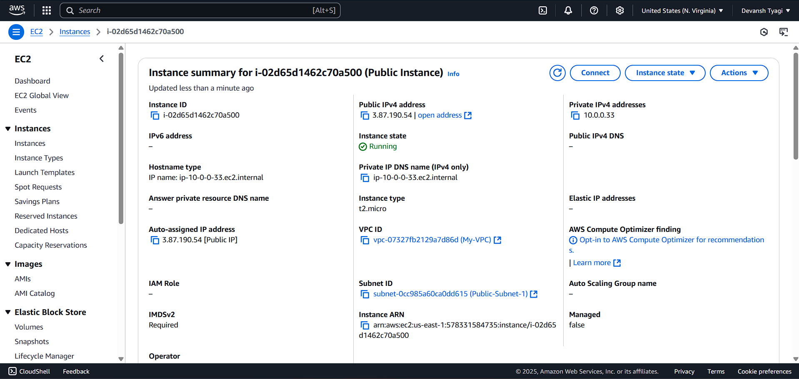
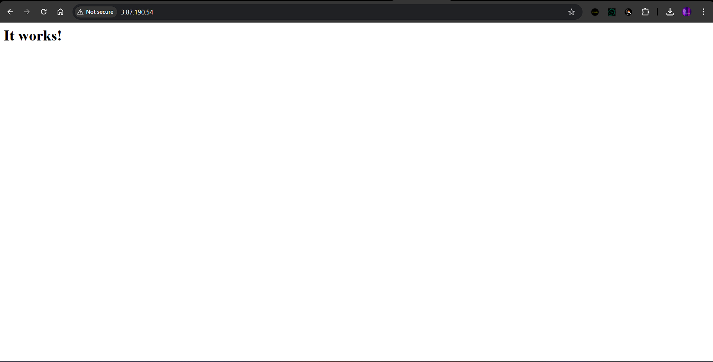

# AWS VPC Setup with Public and Private Subnets Across Two Availability Zones

This README file provides step-by-step instructions to create an AWS VPC setup with the following architecture:

- A single VPC.
- Two Availability Zones (AZs): **Zone A** and **Zone B**.
- Each AZ contains one public subnet and one private subnet:
  - **Zone A**: Public Subnet 1 and Private Subnet 1.
  - **Zone B**: Public Subnet 2 and Private Subnet 2.
- The public subnets are connected to the Internet via an **Internet Gateway (IGW)**.
- The private subnets are connected to each other via a **Virtual Private Gateway (VPG)**.

---

## Definitions

### Virtual Private Cloud (VPC)

A Virtual Private Cloud is a logically isolated section of the AWS cloud where you can launch resources in a virtual network you define. A VPC allows you to control your network settings such as IP address ranges, subnets, route tables, and gateways.

### Subnets

Subnets are subdivisions of a VPC that allow you to group resources by IP range within an Availability Zone. Subnets can be public (accessible from the internet) or private (isolated from the internet).

### Internet Gateway (IGW)

An Internet Gateway is a VPC component that allows resources in public subnets to access the internet. It serves as a target for internet-bound traffic in the route table of a public subnet.

### Virtual Private Gateway (VPG)

A Virtual Private Gateway is a VPN concentrator on the AWS side of a VPN connection. It allows private subnets to securely communicate with other private networks, such as on-premises environments or other VPCs.

### Route Table

A Route Table contains a set of rules, called routes, that determine where network traffic is directed.

### Availability Zone (AZ)

An Availability Zone is a distinct location within an AWS Region that is engineered to be isolated from failures in other zones, providing high availability.

---

## Architecture Overview

### VPC Configuration

- **CIDR Block**: `10.0.0.0/24`

### Subnet Configuration

- **Zone A**:
  - Public Subnet 1: `10.0.0.0/26`
  - Private Subnet 1: `10.0.0.128/26`
- **Zone B**:
  - Public Subnet 2: `10.0.0.64/26`
  - Private Subnet 2: `10.0.0.192/26`

### Gateways

- **IGW**: Connects Public Subnet 1 and Public Subnet 2 to the internet.
- **VPG**: Connects Private Subnet 1 and Private Subnet 2.

---

## Step-by-Step Instructions

### Step 1: Create the VPC

1. Log in to the AWS Management Console.
2. Navigate to **VPC Dashboard**.
3. Click **Create VPC**:
   - **Name**: `My-VPC`.
   - **IPv4 CIDR Block**: `10.0.0.0/24`.
   - Leave other options as default.
4. Click **Create VPC**.

### Step 2: Create Subnets

#### Zone A

1. Navigate to **Subnets** in the VPC Dashboard.
2. Click **Create Subnet**:
   - **Name**: `Public-Subnet-1`.
   - **VPC**: Select `My-VPC`.
   - **Availability Zone**: Select an AZ for Zone A (e.g., `us-east-1a`).
   - **CIDR Block**: `10.0.0.0/26`.
3. Click **Create Subnet**.
4. Repeat the process to create `Private-Subnet-1`:
   - **Availability Zone**: `us-east-1a`.
   - **CIDR Block**: `10.0.0.128/26`.

#### Zone B

1. Create `Public-Subnet-2`:
   - **Availability Zone**: Select an AZ for Zone B (e.g., `us-east-1b`).
   - **CIDR Block**: `10.0.0.64/26`.
2. Create `Private-Subnet-2`:
   - **Availability Zone**: `us-east-1b`.
   - **CIDR Block**: `10.0.0.192/26`.

### Step 3: Create an Internet Gateway (IGW)

1. Navigate to **Internet Gateways** in the VPC Dashboard.
2. Click **Create Internet Gateway**:
   - **Name**: `My-IGW`.
3. Click **Create**.
4. Attach the IGW to `My-VPC`:
   - Select the IGW → **Actions** → **Attach to VPC** → Choose `My-VPC`.

### Step 4: Create a Virtual Private Gateway (VPG)

1. Navigate to **Virtual Private Gateways** in the VPC Dashboard.
2. Click **Create Virtual Private Gateway**:
   - **Name**: `My-VPG`.
   - Leave the ASN as default.
3. Click **Create**.
4. Attach the VPG to `My-VPC`:
   - Select the VPG → **Actions** → **Attach to VPC** → Choose `My-VPC`.

### Step 5: Configure Route Tables

#### Public Route Table

1. Navigate to **Route Tables** in the VPC Dashboard.
2. Create a route table for public subnets:
   - Click **Create Route Table**.
   - **Name**: `Public-Route-Table`.
   - **VPC**: Select `My-VPC`.
3. Add a route for internet traffic:
   - Select the route table → **Routes** tab → **Edit Routes** → **Add Route**.
   - **Destination**: `0.0.0.0/0`.
   - **Target**: Select `My-IGW`.
4. Associate public subnets with the route table:
   - **Subnet Associations** → **Edit Subnet Associations** → Select `Public-Subnet-1` and `Public-Subnet-2`.

#### Private Route Table

1. Create a route table for private subnets:
   - Click **Create Route Table**.
   - **Name**: `Private-Route-Table`.
   - **VPC**: Select `My-VPC`.
2. Enable route propagation for the VPG:
   - Select the route table → **Route Propagation** tab → **Edit Route Propagation** → Select `My-VPG`.
3. Associate private subnets with the route table:
   - **Subnet Associations** → **Edit Subnet Associations** → Select `Private-Subnet-1` and `Private-Subnet-2`.

### Step 6: Launch EC2 Instances

#### Public Subnets

1. Launch an EC2 instance in `Public-Subnet-1`:
   - Select an AMI (e.g., Amazon Linux 2).
   - Configure networking to use `Public-Subnet-1`.
   - Assign a public IP address.
2. Repeat the process for `Public-Subnet-2`.

#### Private Subnets

1. Launch an EC2 instance in `Private-Subnet-1`:

   - **Step 1**: Navigate to the EC2 Dashboard and click **Launch Instance**.
   - **Step 2**: Choose an AMI (e.g., Amazon Linux 2 or Ubuntu).
   - **Step 3**: Choose an instance type (e.g., `t2.micro`).
   - **Step 4**: Configure instance details:
     - **Network**: Select `My-VPC`.
     - **Subnet**: Select `Private-Subnet-1`.
     - **Auto-assign Public IP**: Disable.
     - Leave other options as default or customize as needed.
   - **Step 5**: Add storage (default is fine).
   - **Step 6**: Add tags (optional, e.g., `Key: Name`, `Value: Private-Instance-1`).
   - **Step 7**: Configure security group:
     - Create or select a security group that allows SSH access from a specific IP or CIDR block.
   - **Step 8**: Review and launch:
     - Select an existing key pair or create a new one for SSH access.
     - Click **Launch**.

2. Repeat the process for `Private-Subnet-2`, selecting the corresponding subnet.

---

## Configure a Security Group for SSH Access

### Step 1: Navigate to the Security Groups Section

1. Log in to the **AWS Management Console**.
2. Open the **VPC Dashboard** or **EC2 Dashboard**.
3. On the left-hand navigation menu, click **Security Groups** under **Network & Security**.

### Step 2: Create a New Security Group

1. Click the **Create security group** button.
2. Configure the following settings:
   - **Name tag**: Enter a name for the security group (e.g., `Private-SSH-Access`).
   - **Description**: Provide a description (e.g., `Allows SSH access from specific IP`).
   - **VPC**: Select the VPC (`My-VPC`) where your instance resides.

### Step 3: Configure Inbound Rules

1. Under the **Inbound rules** section, click **Add rule**.
2. Define the SSH rule as follows:
   - **Type**: `SSH`.
   - **Protocol**: `TCP` (auto-filled when SSH is selected).
   - **Port Range**: `22`.
   - **Source**: Select one of the following:
     - **My IP**: Automatically fills in your current public IP address.
     - **Custom**: Enter a specific IP or CIDR block. For example:
       - Single IP: `203.0.113.25/32` (allows only this IP).
       - CIDR Block: `192.168.1.0/24` (allows all IPs in this range).
     - **Anywhere-IPv4 (Not recommended for private instances)**: `0.0.0.0/0` (allows SSH access from any IPv4 address).
3. Click **Save rules**.

### Step 4: (Optional) Configure Outbound Rules

1. By default, all outbound traffic is allowed. If you need to restrict outbound traffic:
   - Click the **Outbound rules** section.
   - Add or modify rules as needed (e.g., limit outbound traffic to specific IPs or services).

### Step 5: Attach the Security Group to Your Instance

1. Navigate to the **EC2 Dashboard**.
2. Select the instance where you want to apply the security group.
3. Click **Actions** → **Security** → **Change security groups**.
4. Select the `Private-SSH-Access` security group you just created.
5. Click **Save**.

---

## Testing and Verification

- Verify public instances have internet access via their public IPs.
- Ensure private instances communicate only via the VPG.
- Use SSH or ping to test connectivity between instances.

---

## Useful Links

- [AWS VPC Documentation](https://docs.aws.amazon.com/vpc/latest/userguide/)
- [AWS EC2 Documentation](https://docs.aws.amazon.com/ec2/latest/userguide/)
- [AWS Internet Gateway Documentation](https://docs.aws.amazon.com/vpc/latest/userguide/VPC_Internet_Gateway.html)
- [AWS Virtual Private Gateway Documentation](https://docs.aws.amazon.com/vpn/latest/s2svpn/VPC_VPN.html)
